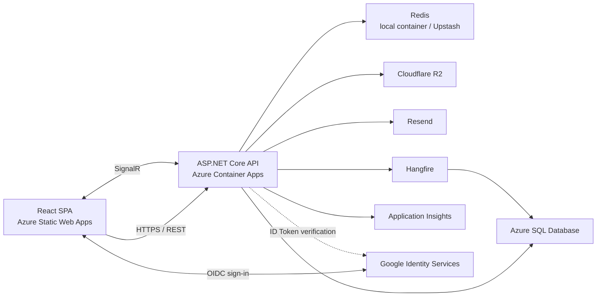

# UUcars Marketplace

UUcars is a personal full-stack portfolio project that models a C2C used-car marketplace. It began as a layered ASP.NET Core API, grew into a deployed React application, and now includes production-oriented capabilities such as Redis caching, rate limiting, background jobs, refresh-token rotation, Google OpenID Connect sign-in, optimistic concurrency, automated testing, real-time notifications and an Admin analytics dashboard.

The repository is organised as a progressive learning project. The detailed development notes preserve that history; the current code, EF Core migrations, configuration and tests define the implemented system.

## Current status

The application currently implements V1, V2 and V3 through **Step 72**.

| Version | Scope | Status |
|---|---|---|
| V1 | Core API, authentication, vehicles, favourites, orders, Admin, tests and Docker | Complete — `v1.0` |
| V2 | Email workflows, R2 images, reviews, React frontend and Azure deployment | Complete — `v2.0` |
| V2.1 | UI design system, responsive layout and vehicle cover images | Complete — `v2.1` |
| V3.1 | Query optimisation, Redis, rate limiting, Hangfire, refresh tokens, concurrency and security | Complete — `v3.1` |
| V3.2 | Image workflow, autosave, optimistic favourites, search improvements and frontend testing | Complete — `v3.2` |
| V3 Step 70–72 | Persistent SignalR notifications, Admin analytics dashboard and Google OIDC sign-in | Complete |
| V3 Step 73–75 | Delivery optimisation, Web Vitals and project close-out | Roadmap |

## What the application supports

### Accounts and security

- Registration with email verification
- Local email/password and Google OpenID Connect sign-in
- External identity linking through the provider and its stable subject identifier
- Resend verification and password-reset email flows through Resend
- JWT access tokens
- Refresh-token rotation with an HttpOnly cookie
- Role-based User and Admin authorisation
- API rate limiting
- Security response headers
- Audit logging for sensitive Admin operations

### Vehicle marketplace

- Draft vehicle listings
- Seller editing and submission for review
- Admin approval, rejection and moderation
- Public vehicle browsing, pagination and filtering
- URL-synchronised search with debouncing and result highlighting
- Cloudflare R2 image storage
- Batch image upload, preview, retry and drag-and-drop ordering
- Draft autosave
- Optimistic concurrency through `Cars.RowVersion`

### Transactions and engagement

- Add and remove favourites with optimistic UI updates
- Buyer order creation and cancellation
- Seller order completion
- Buyer reviews and seller rating summaries
- Persistent user notifications
- Real-time delivery through SignalR user groups
- Read-one and read-all notification actions

### Platform capabilities

- Admin analytics dashboard with six core metrics, two 30-day trend charts and a top-10 brand distribution chart
- Paginated Admin audit-log viewing
- UTC month boundaries and continuous 30-day UTC date buckets for statistics
- Redis cache-aside for vehicle queries and Admin statistics, with database fallback
- Five-minute shared cache for the complete Admin statistics response
- Targeted vehicle-list cache invalidation after relevant business changes
- Hangfire background email jobs and expired-token cleanup
- Serilog structured logging
- Azure Application Insights integration
- Global API exception handling and a consistent response envelope
- React Error Boundary and global query-error feedback

## Architecture



The backend follows a Controller–Service–Repository structure:

```text
HTTP request
→ Controller
→ Service business rules
→ Repository / external service
→ EF Core, Redis, R2, Resend or SignalR
→ ApiResponse<T>
```

## Technology stack

| Area | Technologies |
|---|---|
| Backend | ASP.NET Core 9, C#, Entity Framework Core 9, SQL Server |
| Authentication | JWT Bearer authentication, refresh-token rotation, Google OpenID Connect, ASP.NET Core PasswordHasher |
| Frontend | React 19, TypeScript 6, Vite 8, React Router 7 |
| UI | Tailwind CSS 4, shadcn/ui, Radix UI, Lucide React, Embla Carousel, Recharts |
| State and data | Zustand, TanStack Query 5, Axios |
| Forms | React Hook Form, Zod |
| Infrastructure | Redis, Hangfire, Cloudflare R2, Resend, SignalR |
| Observability | Serilog, Azure Application Insights |
| Backend testing | xUnit, WebApplicationFactory, Testcontainers for SQL Server |
| Frontend testing | Vitest, React Testing Library, Playwright |
| Delivery | Docker, Docker Compose, GitHub Actions, GHCR, Azure Container Apps, Azure Static Web Apps, Azure SQL Database |

## Repository structure

```text
UUcars/
├── UUcars.API/                 ASP.NET Core API
│   ├── Controllers/
│   ├── Services/
│   ├── Repositories/
│   ├── Entities/
│   ├── DTOs/
│   ├── Configurations/
│   ├── Migrations/
│   ├── Middleware/
│   ├── Extensions/
│   └── Hubs/
├── UUcars.Tests/               Backend unit and integration tests
├── uucars-web/                 React application
│   ├── src/
│   └── e2e/
├── docs/                       Development notes and version outlines
├── .github/workflows/          CI/CD workflows
├── Dockerfile
├── docker-compose.yml
└── UUcars.sln
```

## Data model

The current EF Core model contains:

```text
Users
Cars
CarImages
Favorites
Orders
Reviews
RefreshTokens
ExternalLogins
AuditLogs
Notifications
```

Important constraints include:

- Unique user email addresses
- Unique external identity on `ExternalLogins(Provider, ProviderSubject)`
- Optional local password for users created through Google sign-in
- Composite key on `Favorites(UserId, CarId)`
- One review per order
- Snapshot price and seller identity on an order
- Optimistic concurrency token on `Cars.RowVersion`
- User ownership checks for listings, images, favourites, orders and notifications

EF Core migrations and `AppDbContextModelSnapshot` are the authoritative database definition.

## Core API routes

The API uses a common `ApiResponse<T>` envelope. The principal routes are:

| Area | Routes |
|---|---|
| Authentication | `POST /auth/register`, `POST /auth/login`, `POST /auth/google`, `GET /auth/verify-email`, `POST /auth/resend-verification`, `POST /auth/forgot-password`, `POST /auth/reset-password`, `POST /auth/refresh`, `POST /auth/logout` |
| Current user | `GET /users/me`, `PUT /users/me` |
| Vehicles | `GET /cars`, `GET /cars/{id}`, `POST /cars`, `PUT /cars/{id}`, `DELETE /cars/{id}`, `POST /cars/{id}/submit`, `GET /cars/my-listings` |
| Vehicle images | `POST /cars/{id}/images`, `POST /cars/{id}/images/batch`, `PUT /cars/{id}/images/reorder`, `DELETE /cars/{id}/images/{imageId}` |
| Favourites | `GET /favorites`, `GET /favorites/{carId}`, `POST /favorites/{carId}`, `DELETE /favorites/{carId}` |
| Orders | `POST /orders`, `POST /orders/{id}/cancel`, `POST /orders/{id}/complete`, `GET /orders/my-purchases`, `GET /orders/my-sales` |
| Reviews | `POST /reviews`, `GET /reviews/seller/{sellerId}` |
| Notifications | `GET /notifications`, `PUT /notifications/{id}/read`, `PUT /notifications/read-all` |
| Admin | `GET /admin/stats`, `GET /admin/cars/pending`, `POST /admin/cars/{id}/approve`, `POST /admin/cars/{id}/reject`, `DELETE /admin/cars/{id}`, `GET /admin/audit-logs` |
| SignalR | `/hubs/notification` |

In Development, interactive Scalar documentation is available at:

```text
http://localhost:5065/scalar/v1
```

## Local development

### Prerequisites

- .NET 9 SDK
- Node.js `^20.19.0` or `>=22.12.0`
- Docker Desktop or another Docker-compatible runtime
- A Google OAuth 2.0 Web client ID for real Google sign-in
- Cloudflare R2 credentials for real image operations
- A Resend API key for real email delivery

### 1. Clone the repository

```bash
git clone https://github.com/Robert-J-WANG/UUcars.git
cd UUcars
```

### 2. Configure local infrastructure

Set the two values in the root `.env` file:

```dotenv
DB_PASSWORD=choose-a-strong-local-password
JWT_SECRET=choose-a-long-random-secret
```

Start SQL Server and Redis:

```bash
docker compose up -d sqlserver redis
```

### 3. Configure the API

The project uses .NET User Secrets for local sensitive configuration:

```bash
dotnet user-secrets --project UUcars.API set \
  "ConnectionStrings:DefaultConnection" \
  "Server=localhost,1433;Database=UUcarsDB;User Id=sa;Password=YOUR_DB_PASSWORD;TrustServerCertificate=True"

dotnet user-secrets --project UUcars.API set \
  "ConnectionStrings:Redis" \
  "localhost:6379"

dotnet user-secrets --project UUcars.API set \
  "JwtSettings:Secret" \
  "YOUR_LONG_RANDOM_JWT_SECRET"

dotnet user-secrets --project UUcars.API set \
  "GoogleAuth:ClientId" \
  "YOUR_GOOGLE_CLIENT_ID"

dotnet user-secrets --project UUcars.API set \
  "EmailSettings:ApiKey" \
  "YOUR_RESEND_API_KEY"

dotnet user-secrets --project UUcars.API set \
  "StorageSettings:AccessKeyId" \
  "YOUR_R2_ACCESS_KEY_ID"

dotnet user-secrets --project UUcars.API set \
  "StorageSettings:SecretAccessKey" \
  "YOUR_R2_SECRET_ACCESS_KEY"

dotnet user-secrets --project UUcars.API set \
  "StorageSettings:AccountId" \
  "YOUR_R2_ACCOUNT_ID"

dotnet user-secrets --project UUcars.API set \
  "StorageSettings:PublicUrl" \
  "YOUR_R2_PUBLIC_URL"
```

The non-secret defaults, including issuer, audience, bucket name and local frontend URL, are defined in `UUcars.API/appsettings.json`.

### 4. Run the API

```bash
dotnet restore
dotnet run --project UUcars.API
```

The API starts at `http://localhost:5065`. In the current learning-project setup, pending EF Core migrations are applied automatically during API startup.

### 5. Run the frontend

Create or update `uucars-web/.env.local`:

```dotenv
VITE_API_BASE_URL=http://localhost:5065
VITE_GOOGLE_CLIENT_ID=YOUR_GOOGLE_CLIENT_ID
```

Then run:

```bash
cd uucars-web
npm ci
npm run dev
```

The frontend starts at `http://localhost:5173`.

### Dockerised API option

To run SQL Server, Redis and the API together:

```bash
docker compose up --build
```

The containerised API is exposed at `http://localhost:8080`. Configure the frontend URL accordingly when using this option. Real email and R2 operations still require their corresponding environment configuration.

## Testing and quality checks

### Backend

```bash
dotnet build
dotnet test
```

Backend integration tests use Testcontainers and therefore require Docker.

### Frontend

```bash
cd uucars-web
npm run lint
npm run build
npm test -- --run
npm run test:coverage
```

### End-to-end

With the API running on port `5065` and the frontend on port `5173`:

```bash
cd uucars-web
npm run e2e
```

Five Playwright journeys cover registration, seller listing submission, Admin approval, buyer ordering and seller order viewing.

The GitHub Actions E2E job currently preserves the intended staging-test structure but deliberately skips the real Playwright command until a dedicated staging environment is available.

## Production delivery

The implemented production architecture uses:

- Azure Static Web Apps for the React frontend
- Azure Container Apps for the ASP.NET Core API
- Azure SQL Database
- GitHub Container Registry for the API image
- GitHub Actions for build and deployment
- Azure OIDC federated identity for backend deployment
- Cloudflare R2 for vehicle images
- Resend for transactional email

The backend workflow runs unit tests on branch pushes. On `main`, it builds and publishes the Docker image and deploys the API to Azure Container Apps. The frontend workflow builds and deploys the React application to Azure Static Web Apps.

Production secrets are supplied through GitHub or Azure configuration and are not intended to be committed to the repository.

## Documentation

### Final development outlines

- [V1 complete development outline](docs/v1_完整纲要.md)
- [V2 complete development outline](docs/v2_完整纲要.md)
- [V3 complete development outline](docs/v3_完整纲要.md)

### Database

- [Current database schema](docs/database-schema.md)

### Historical development notes

- [V1 step-by-step notes](docs/steps_v1.md)
- [V2 step-by-step notes](docs/steps_v2.md)
- [V3 step-by-step notes](docs/steps_v3.md)

The step-by-step files preserve the learning process and may include intermediate approaches that were later refined. Use the final outlines for the planned version structure and the current code, migrations, configuration and tests for the implemented system.

The database schema is maintained against the current EF Core migrations and model snapshot.

## Roadmap

The remaining V3 outline covers:

- CI/CD hardening
- Bundle analysis and Web Vitals
- Final documentation, release and portfolio presentation

These items are planned and are not presented as completed functionality.
