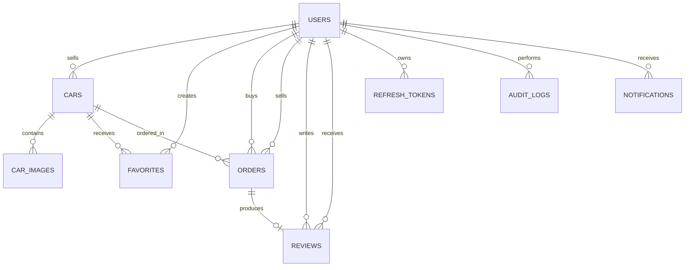

# UUcars 数据库 Schema

> 当前 Schema 以 `UUcars.API/Migrations/AppDbContextModelSnapshot.cs`、EF Core Migrations 和实体配置为准。
>
> 本文覆盖 V1–V3 Step 70 已实现的数据库结构。后续开发若新增 Migration，应先更新本文

---

## 数据库概览

当前使用 SQL Server，共 9 张业务表：

```text
Users           V1 创建，V2 扩展
Cars            V1 创建，V3 扩展
CarImages       V1
Favorites       V1
Orders          V1
Reviews         V2
RefreshTokens   V3
AuditLogs       V3
Notifications   V3
```

### 版本演进

开发每个版本时，只执行该版本对应的 Schema 内容和 Migration：

```text
V1 初始 Schema
├── Users
├── Cars
├── CarImages
├── Favorites
└── Orders

V2 Schema 增量
├── Users 邮箱验证字段
├── Users 密码重置字段
└── Reviews

V3 Schema 增量
├── Cars 查询索引
├── RefreshTokens
├── Cars.RowVersion
├── AuditLogs
└── Notifications
```

版本标记说明：

- `V1`：创建 V1 数据库时需要。
- `V2`：在 V1 Schema 上通过 V2 Migration 增加。
- `V3`：在 V2 Schema 上通过 V3 Migration 增加。
- “V1 预留，V2 使用”：字段在 V1 已存在，但对应业务从 V2 开始启用。
- Cloudflare R2 图片上传改变了 V2 的存储实现，但没有增加 CarImages 字段。

### 关系图

下图表示 Step 70 时的当前完整关系；开发早期版本时，应结合各表的版本标记使用。



说明：

- `Favorites` 使用 `(UserId, CarId)` 联合主键，实现 Users 与 Cars 的多对多收藏关系。
- `Orders` 同时通过 `BuyerId` 和 `SellerId` 关联 Users。
- `Reviews.OrderId` 是唯一索引，因此一个订单最多对应一条评价。
- `AuditLogs.EntityId` 和 `Notifications.RelatedId` 是通用业务关联字段，不配置数据库外键。

---

## Users `[V1 创建，V2 扩展]`

用户、认证和账户恢复信息。

| 字段 | SQL 类型 | Null | 约束或默认值 | 引入版本 | 说明 |
|---|---|---:|---|---|---|
| Id | int | 否 | PK, Identity | V1 | 自增主键 |
| Username | nvarchar(50) | 否 | | V1 | 用户名 |
| Email | nvarchar(100) | 否 | UNIQUE | V1 | 登录邮箱 |
| PasswordHash | nvarchar(256) | 否 | | V1 | ASP.NET Core PasswordHasher 生成的密码 Hash |
| Role | nvarchar(20) | 否 | | V1 | `User` / `Admin` |
| EmailConfirmed | bit | 否 | DEFAULT `false` | V1 预留，V2 使用 | 邮箱是否已验证 |
| EmailConfirmationToken | nvarchar(200) | 是 | | V2 | 一次性邮箱验证 Token |
| EmailConfirmationTokenExpiry | datetime2 | 是 | | V2 | 邮箱验证 Token 过期时间 |
| ResetPasswordToken | nvarchar(200) | 是 | | V2 | 一次性密码重置 Token |
| ResetPasswordTokenExpiry | datetime2 | 是 | | V2 | 密码重置 Token 过期时间 |
| CreatedAt | datetime2 | 否 | | V1 | 创建时间 |
| UpdatedAt | datetime2 | 否 | | V1 | 最后更新时间 |

### 索引

```text
PK_Users (Id)
IX_Users_Email UNIQUE (Email)
```

### Seed

- Initial Migration 写入一条固定 Id 的 Admin Seed。
- Seed 中保存 Password Hash，不保存明文密码。
- 生产环境应使用独立、安全的凭据管理方式。

---

## Cars `[V1 创建，V3 扩展]`

车辆核心资料、业务状态和并发控制。

| 字段 | SQL 类型 | Null | 约束或默认值 | 引入版本 | 说明 |
|---|---|---:|---|---|---|
| Id | int | 否 | PK, Identity | V1 | 自增主键 |
| Title | nvarchar(100) | 否 | | V1 | 车辆标题 |
| Brand | nvarchar(50) | 否 | | V1 | 品牌 |
| Model | nvarchar(50) | 否 | | V1 | 车型 |
| Year | int | 否 | | V1 | 出厂年份 |
| Price | decimal(18,2) | 否 | | V1 | 售价 |
| Mileage | int | 否 | | V1 | 里程，单位由业务层按 km 处理 |
| Description | nvarchar(2000) | 是 | | V1 | 车辆描述 |
| SellerId | int | 否 | FK → Users.Id | V1 | 卖家 |
| Status | nvarchar(20) | 否 | | V1 | 车辆状态 |
| RowVersion | rowversion | 否 | Concurrency Token | V3 | SQL Server 自动生成的乐观锁版本 |
| CreatedAt | datetime2 | 否 | | V1 | 创建时间 |
| UpdatedAt | datetime2 | 否 | | V1 | 最后更新时间 |

### 状态

```text
Draft
PendingReview
Published
Sold
Deleted
```

主要状态流转：

```text
Draft
→ PendingReview
→ Published
→ Sold

PendingReview
→ Draft

Draft / Published
→ Deleted
```

具体流转权限和前置条件由 Service 层控制。

### 索引

以下 4 个查询索引均在 V3 Step 57 增加：

```text
PK_Cars (Id)
  V1

IX_Cars_Status_CreatedAt
  (Status ASC, CreatedAt DESC)
  V3

IX_Cars_Status_Brand
  (Status, Brand)
  V3

IX_Cars_Status_Price
  (Status, Price)
  V3

IX_Cars_SellerId_Status_CreatedAt
  (SellerId ASC, Status ASC, CreatedAt DESC)
  V3
```

V1 Initial Migration 曾为 `SellerId` 自动建立：

```text
IX_Cars_SellerId (SellerId)
```

V3 的 `AddCarIndexes` Migration 删除该单列索引，并使用
`IX_Cars_SellerId_Status_CreatedAt` 复合索引替代。执行 V1 时仍应保留
Initial Migration 中的单列索引；只有进入 V3 后才进行替换。

### 关系与删除行为

```text
Cars.SellerId → Users.Id
DeleteBehaviour: Restrict
```

存在关联车辆时，不允许直接删除对应用户。

### 乐观并发

`RowVersion` 是 SQL Server `rowversion` 字段，同时被 EF Core 标记为：

```text
ConcurrencyToken
ValueGeneratedOnAddOrUpdate
```

更新车辆时，EF Core 会在 `UPDATE` 条件中比较原始 RowVersion。如果数据已被其他请求修改，受影响行数为 0，并触发并发异常。

---

## CarImages `[V1]`

车辆图片记录。真实文件存储在 Cloudflare R2，数据库只保存公开 URL 和显示顺序。

| 字段 | SQL 类型 | Null | 约束或默认值 | 引入版本 | 说明 |
|---|---|---:|---|---|---|
| Id | int | 否 | PK, Identity | V1 | 自增主键 |
| CarId | int | 否 | FK → Cars.Id | V1 | 所属车辆 |
| ImageUrl | nvarchar(500) | 否 | | V1 | V1 保存 URL；V2 开始保存 R2 公开 URL |
| SortOrder | int | 否 | DEFAULT `0` | V1 | 图片显示顺序 |

### 索引

```text
PK_CarImages (Id)
IX_CarImages_CarId (CarId)
```

### 关系与删除行为

```text
CarImages.CarId → Cars.Id
DeleteBehaviour: Cascade
```

车辆被物理删除时，对应图片记录级联删除。R2 对象删除由业务服务负责，不由数据库处理。

---

## Favorites `[V1]`

用户收藏关系。

| 字段 | SQL 类型 | Null | 约束或默认值 | 引入版本 | 说明 |
|---|---|---:|---|---|---|
| UserId | int | 否 | PK, FK → Users.Id | V1 | 收藏用户 |
| CarId | int | 否 | PK, FK → Cars.Id | V1 | 被收藏车辆 |
| CreatedAt | datetime2 | 否 | | V1 | 收藏时间 |

### 主键与索引

```text
PK_Favorites (UserId, CarId)
IX_Favorites_CarId (CarId)
```

联合主键从数据库层防止同一用户重复收藏同一车辆。

### 关系与删除行为

```text
Favorites.UserId → Users.Id
DeleteBehaviour: Cascade

Favorites.CarId → Cars.Id
DeleteBehaviour: Cascade
```

---

## Orders `[V1]`

买卖订单及交易状态。

| 字段 | SQL 类型 | Null | 约束或默认值 | 引入版本 | 说明 |
|---|---|---:|---|---|---|
| Id | int | 否 | PK, Identity | V1 | 自增主键 |
| CarId | int | 否 | FK → Cars.Id | V1 | 订单车辆 |
| BuyerId | int | 否 | FK → Users.Id | V1 | 买家 |
| SellerId | int | 否 | FK → Users.Id | V1 | 下单时从车辆保存的卖家 Id |
| Price | decimal(18,2) | 否 | | V1 | 下单时锁定的价格 |
| Status | nvarchar(20) | 否 | | V1 | 订单状态 |
| CreatedAt | datetime2 | 否 | | V1 | 创建时间 |
| UpdatedAt | datetime2 | 否 | | V1 | 最后更新时间 |

### 状态

```text
Pending
Completed
Cancelled
```

主要状态流转：

```text
Pending → Completed
Pending → Cancelled
```

### 索引

```text
PK_Orders (Id)
IX_Orders_CarId (CarId)
IX_Orders_BuyerId (BuyerId)
IX_Orders_SellerId (SellerId)
```

### 关系与删除行为

```text
Orders.CarId → Cars.Id
DeleteBehaviour: Restrict

Orders.BuyerId → Users.Id
DeleteBehaviour: Restrict

Orders.SellerId → Users.Id
DeleteBehaviour: Restrict
```

订单保留交易历史，因此车辆、买家或卖家存在订单时不能被数据库级联删除。

---

## Reviews `[V2]`

买家对已完成订单中的卖家评价。

| 字段 | SQL 类型 | Null | 约束或默认值 | 引入版本 | 说明 |
|---|---|---:|---|---|---|
| Id | int | 否 | PK, Identity | V2 | 自增主键 |
| OrderId | int | 否 | FK → Orders.Id, UNIQUE | V2 | 被评价的订单 |
| ReviewerId | int | 否 | FK → Users.Id | V2 | 评价人，业务上为买家 |
| RevieweeId | int | 否 | FK → Users.Id | V2 | 被评价人，业务上为卖家 |
| Rating | int | 否 | | V2 | 评分 |
| Comment | nvarchar(500) | 是 | | V2 | 可选评价内容 |
| CreatedAt | datetime2 | 否 | | V2 | 创建时间 |
| UpdatedAt | datetime2 | 否 | | V2 | 最后更新时间 |

### 索引

```text
PK_Reviews (Id)
IX_Reviews_OrderId UNIQUE (OrderId)
IX_Reviews_ReviewerId (ReviewerId)
IX_Reviews_RevieweeId (RevieweeId)
```

### 关系与删除行为

```text
Reviews.OrderId → Orders.Id
DeleteBehaviour: Restrict

Reviews.ReviewerId → Users.Id
DeleteBehaviour: Restrict

Reviews.RevieweeId → Users.Id
DeleteBehaviour: Restrict
```

### 业务约束

- 一个订单只能创建一条评价。
- 只有对应订单的买家可以评价。
- 订单必须处于 `Completed`。
- Rating 必须在 1–5 之间。

其中 Rating 范围和用户身份由 DTO/Service 层验证；当前数据库没有 Rating Check Constraint。

---

## RefreshTokens `[V3]`

JWT Refresh Token 轮换和撤销记录。

| 字段 | SQL 类型 | Null | 约束或默认值 | 引入版本 | 说明 |
|---|---|---:|---|---|---|
| Id | int | 否 | PK, Identity | V3 | 自增主键 |
| Token | nvarchar(256) | 否 | UNIQUE | V3 | 随机生成的不透明 Token，不是 JWT |
| UserId | int | 否 | FK → Users.Id | V3 | Token 所属用户 |
| ExpiresAt | datetime2 | 否 | | V3 | 过期时间 |
| IsRevoked | bit | 否 | DEFAULT `false` | V3 | 是否已使用或主动撤销 |
| CreatedAt | datetime2 | 否 | | V3 | 创建时间 |

### 索引

```text
PK_RefreshTokens (Id)
IX_RefreshTokens_Token UNIQUE (Token)
IX_RefreshTokens_UserId_IsRevoked_ExpiresAt
  (UserId, IsRevoked, ExpiresAt)
```

### 关系与删除行为

```text
RefreshTokens.UserId → Users.Id
DeleteBehaviour: Cascade
```

Refresh Token 每次使用后撤销，并签发新的 Token。过期或撤销记录由 Hangfire 定时任务清理。

---

## AuditLogs `[V3]`

Admin 关键操作审计记录。该表只新增记录，不更新历史记录。

| 字段 | SQL 类型 | Null | 约束或默认值 | 引入版本 | 说明 |
|---|---|---:|---|---|---|
| Id | int | 否 | PK, Identity | V3 | 自增主键 |
| AdminId | int | 否 | FK → Users.Id | V3 | 执行操作的 Admin |
| Action | nvarchar(50) | 否 | | V3 | 操作类型 |
| EntityType | nvarchar(50) | 否 | | V3 | 被操作实体类型 |
| EntityId | int | 否 | | V3 | 被操作实体 Id |
| Detail | nvarchar(500) | 是 | | V3 | 补充说明 |
| CreatedAt | datetime2 | 否 | | V3 | 操作时间 |

当前车辆审核相关 Action：

```text
CarApproved
CarRejected
CarDeleted
```

### 索引

```text
PK_AuditLogs (Id)
IX_AuditLogs_AdminId (AdminId)
IX_AuditLogs_Action_CreatedAt (Action, CreatedAt)
```

### 关系与删除行为

```text
AuditLogs.AdminId → Users.Id
DeleteBehaviour: Restrict
```

`EntityType + EntityId` 用于通用业务定位，不配置具体数据库外键。

---

## Notifications `[V3]`

用户通知持久化记录。SignalR 负责实时推送，数据库保证用户离线后仍可查看通知。

| 字段 | SQL 类型 | Null | 约束或默认值 | 引入版本 | 说明 |
|---|---|---:|---|---|---|
| Id | int | 否 | PK, Identity | V3 | 自增主键 |
| UserId | int | 否 | FK → Users.Id | V3 | 通知接收者 |
| Type | nvarchar(50) | 否 | | V3 | 通知类型 |
| Message | nvarchar(300) | 否 | | V3 | 显示给用户的通知正文 |
| RelatedId | int | 是 | | V3 | 关联 CarId 或 OrderId |
| IsRead | bit | 否 | DEFAULT `false` | V3 | 是否已读 |
| CreatedAt | datetime2 | 否 | | V3 | 创建时间 |

当前通知类型：

```text
CarApproved
CarRejected
NewOrder
OrderCancelled
```

### 索引

```text
PK_Notifications (Id)
IX_Notifications_UserId_IsRead_CreatedAt
  (UserId, IsRead, CreatedAt)
```

该复合索引用于按用户查询未读通知并按时间排序。

### 关系与删除行为

```text
Notifications.UserId → Users.Id
DeleteBehaviour: Cascade
```

`RelatedId` 根据 `Type` 表示不同业务实体，因此不配置固定数据库外键。

---

## 删除行为总览

| Principal | Dependent | 外键 | DeleteBehaviour | 引入版本 | 原因 |
|---|---|---|---|---|---|
| Users | Cars | SellerId | Restrict | V1 | 保留车辆与卖家关系 |
| Cars | CarImages | CarId | Cascade | V1 | 图片记录依附于车辆 |
| Users | Favorites | UserId | Cascade | V1 | 用户删除后收藏关系无独立意义 |
| Cars | Favorites | CarId | Cascade | V1 | 车辆删除后收藏关系无独立意义 |
| Cars | Orders | CarId | Restrict | V1 | 保留订单历史 |
| Users | Orders | BuyerId | Restrict | V1 | 保留买家订单历史 |
| Users | Orders | SellerId | Restrict | V1 | 保留卖家订单历史 |
| Orders | Reviews | OrderId | Restrict | V2 | 保留评价来源 |
| Users | Reviews | ReviewerId | Restrict | V2 | 保留评价人关系 |
| Users | Reviews | RevieweeId | Restrict | V2 | 保留被评价人关系 |
| Users | RefreshTokens | UserId | Cascade | V3 | 用户删除后 Token 无效 |
| Users | AuditLogs | AdminId | Restrict | V3 | 保护审计历史 |
| Users | Notifications | UserId | Cascade | V3 | 用户删除后通知无独立意义 |

---

## Migration 历史

当前 Migration 按版本分组如下：

### V1 Migration

```text
20260403095259_InitialCreate
```

创建：

```text
Users
Cars
CarImages
Favorites
Orders
```

### V2 Migrations

```text
20260423100822_AddEmailVerificationFields
20260424011110_AddPasswordResetFields
20260427020720_AddReviewsTable
```

依次增加：

```text
Users.EmailConfirmationToken
Users.EmailConfirmationTokenExpiry

Users.ResetPasswordToken
Users.ResetPasswordTokenExpiry

Reviews
```

Cloudflare R2 图片上传沿用 V1 的 `CarImages.ImageUrl`，因此没有单独的图片存储 Migration。

### V3 Migrations

```text
20260526115201_AddCarIndexes
20260612043831_AddRefreshTokensTable
20260616120500_AddCarRowVersion
20260619231332_AddAuditLogsTable
20260721041503_AddNotificationsTable
```

依次增加：

```text
删除 IX_Cars_SellerId
增加 4 个 Cars 查询复合索引
RefreshTokens
Cars.RowVersion
AuditLogs
Notifications
```

新增或修改数据库结构时：

```bash
dotnet ef migrations add MigrationName \
  --project UUcars.API \
  --startup-project UUcars.API

dotnet ef database update \
  --project UUcars.API \
  --startup-project UUcars.API
```

提交 Migration 前应检查：

- Migration Up/Down 是否只包含目标变化。
- `AppDbContextModelSnapshot` 是否同步更新。
- 字段 Nullability、长度、精度和默认值是否正确。
- 索引是否匹配真实查询。
- 外键删除行为是否符合业务历史保留要求。
- 相关单元测试和集成测试是否通过。
